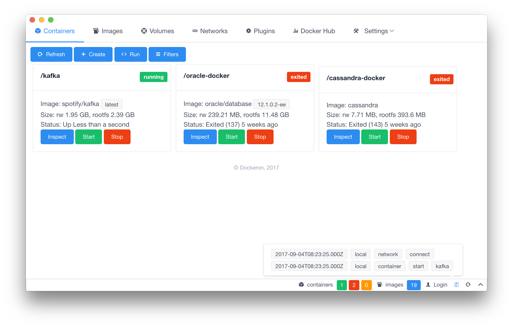
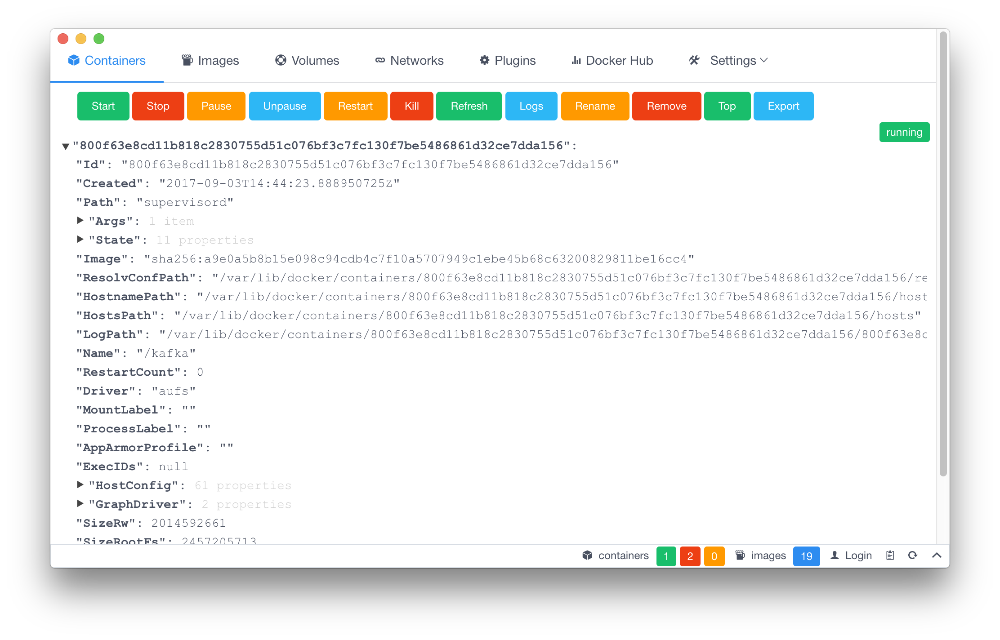
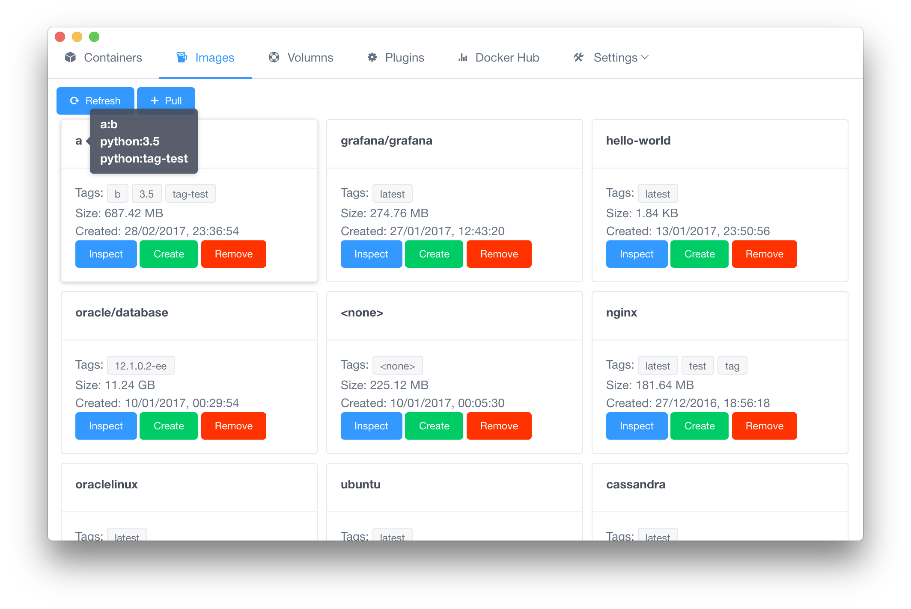
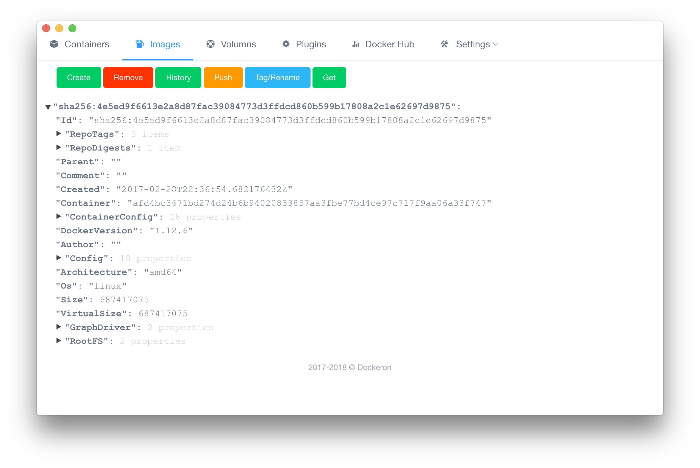
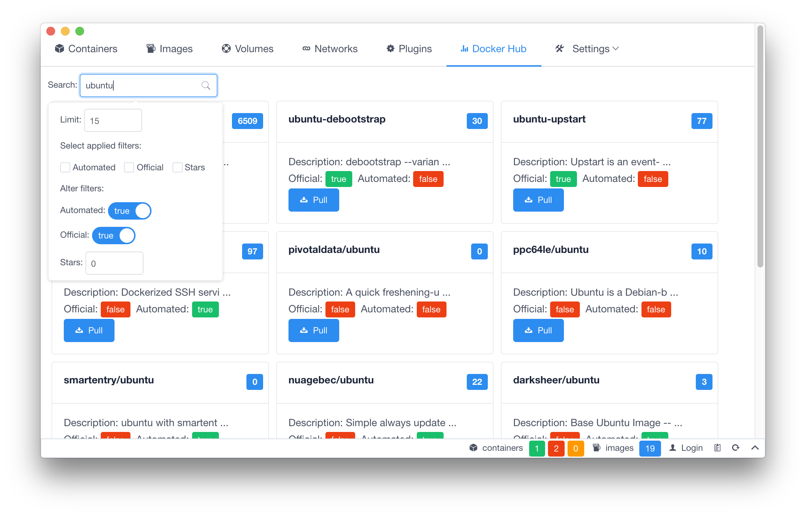
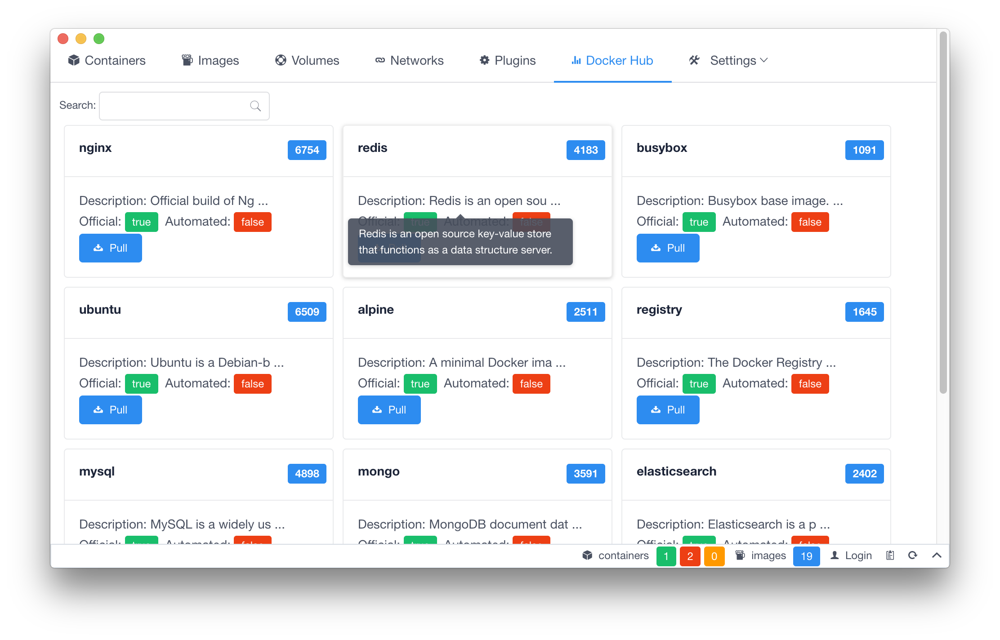

# Dockeron

[](https://travis-ci.org/dockeron/dockeron)
[](https://ci.appveyor.com/project/fluency03/dockeron)
[](https://github.com/dockeron/dockeron/tags)
[](https://github.com/dockeron/dockeron/releases)
[](https://www.npmjs.com/package/dockeron)
[](https://www.npmjs.com/package/dockeron)
[](https://opensource.org/licenses/MIT)
[](https://github.com/dockeron/dockeron)

[](https://github.com/feross/standard)

*In development process.*

A dockeron project, built on Electron + Vue.js for Docker.

Docker Engine API [dockerode](https://github.com/apocas/dockerode).

UI components: [iView](https://github.com/iview/iview)

*Now, there are only Mac and Linux versions. I am only using Mac version, Linux version is to be tested. Windows version is coming. Notice that, this project is still in development process, many functionalities or features are not implemented yet, and some parts are still buggy.*

Welcome PR and issues.


TODOs and progress, please see [project dockeron](https://github.com/dockeron/dockeron/projects/1).


## Development

Make sure you have Node.js installed (node@^6.5.0 or higher is recommended).

```
git clone git@github.com:dockeron/dockeron.git
cd dockeron
npm install
npm run dev
```

## Contributing

[Contributing to Dockeron](https://github.com/dockeron/dockeron/blob/master/CONTRIBUTING.md)

## Screenshots










*This project was generated from [electron-vue](https://github.com/SimulatedGREG/electron-vue).*
